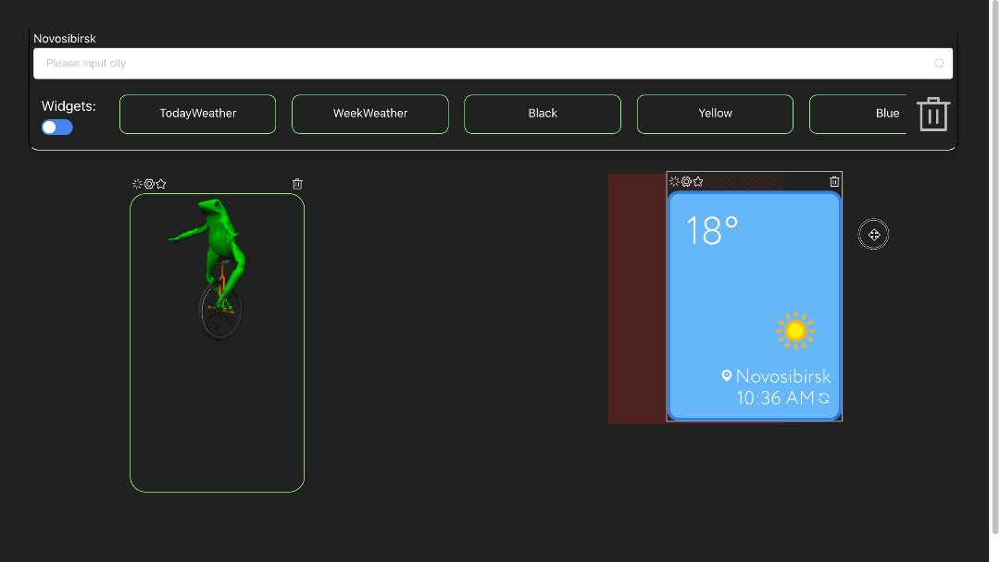

<h1>

  
   Classic Grid Layout
</h1>

   Vue 2 grid, for creating and managing components.

____

  <a href="#about-the-project">About the Project</a> •
  <a href="#what-problems-does-it-solve">What problems does it solve?</a> •
  <a href="#usage">How To Use</a> •
  <a href="#other-features">Features</a> •
  <a href="#more-info">More info</a> •
  <a href="#credits">Credits</a> •

<h1>

  
</h1>

## About The Project

The Classic Grid Layout is a simple and convenient grid in which you can place any widgets and make them custom. This is
a web application written in Vue and based on vue-grid-layout, which provides a grid with the ability to move items.
With it, you can create any widgets, place them in the grid as you like, set custom styling and delete unnecessary ones.
In addition, what could be better than your own content appearance management?

## What problems does it solve

- The complexity of user interaction with "products"
- Bad user experience.
- Lack of content flexibility.
- The lack of basic functionality of the grid layout, such as convenient removal and management of widgets.

## Usage

For example, a version of the weather site was created using a grid layout. To create a widget, drag it to the layout.
The selected city is on top, it can be changed by input. The widget is created with the city currently selected. Each
widget stores its city values ​​in localStorage.

<h1>

  
</h1>

You can also change the style of any widget by clicking on the settings at the top of it.

<h1>

  
</h1>

You can delete widgets by dragging them to the Trash, and you can also use the Ctrl + click shortcut to select multiple
widgets and delete them with the Backspace key. You can also just click on the basket at the top of the widget.

<h1>

  
</h1>

## Other features

You can turn off preview mode with a switcher, this is useful if you know perfectly well what you will be dragging.
Also, each widget can be positioned as convenient and pinned. In the weather widget, you can change the city without
recreating the widget, you just need to enter select a new city in the input and click on the city name in the widget.

<h1>

  
</h1>

## More info

The project is written in the vue 2 framework, using OOP, with the help of vue-class-component. All widgets are
completely independent and are able to change their styles, add new ones and change old ones. All data needed for the
component is stored in LocalStorage. The weather data is stored in the Vuex Store in order not to produce requests to
the server. The main class that provides methods for working with Classic Grid Layout is Layout Storage, Grid Layout
inherits from it.

## Credits

Author and developer Dmitriev Roman, junior frontend developer.

### Social networks

- Telegram: classic_rd
- Vk: classic_rd

 

